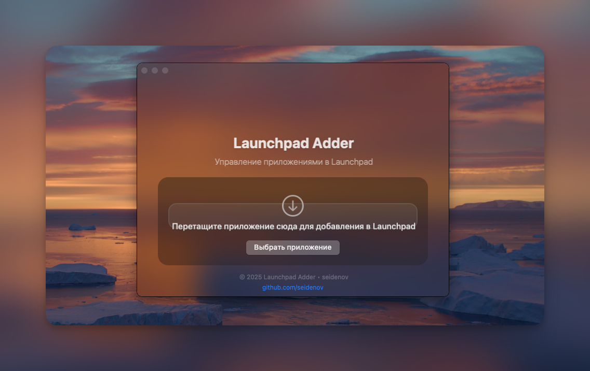

# Launchpad Adder

Простое приложение для macOS, которое позволяет добавлять приложения в Launchpad, даже если они находятся на внешних дисках или в нестандартных местах.



## Возможности

- Добавление приложений в Launchpad через перетаскивание
- Выбор приложений через стандартный диалог выбора файлов
- Удаление приложений из Launchpad
- Поддержка светлой и темной темы macOS

## Требования

- macOS 10.13 (High Sierra) или новее
- Права на запись в директорию `/Applications`

## Установка

### Вариант 1: Скачать готовое приложение

1. Скачайте последнюю версию приложения из раздела [Releases](https://github.com/seidenov/LaunchpadAdder/releases)
2. Распакуйте архив
3. Перетащите `LaunchpadAdder.app` в папку `/Applications` или запустите из любого удобного места

### Вариант 2: Сборка из исходного кода

1. Клонируйте репозиторий:
   ```bash
   git clone https://github.com/seidenov/LaunchpadAdder.git
   cd LaunchpadAdder
   ```

2. Запустите скрипт сборки:
   ```bash
   ./build.sh
   ```

3. Готовое приложение будет находиться в директории `build/LaunchpadAdder.app`

## Использование

1. Запустите приложение
2. Выберите приложение одним из способов:
   - Перетащите .app файл в окно приложения
   - Нажмите кнопку "Выбрать приложение" и укажите .app файл через диалог
3. Нажмите "Добавить в Launchpad" для создания символической ссылки в `/Applications`
4. Или нажмите "Удалить из Launchpad" для удаления символической ссылки

## Как это работает

Приложение создает символическую ссылку на выбранное приложение в директории `/Applications`, что позволяет Launchpad обнаружить его. При удалении приложения из Launchpad, удаляется только символическая ссылка, оригинальное приложение остается нетронутым.

## Лицензия

MIT © 2025 seidenov

## Автор

seidenov - [GitHub](https://github.com/seidenov) 